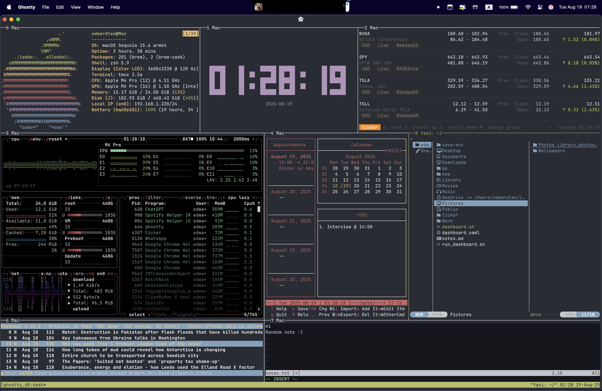

# StackTrace

**Terminal workspace dashboard — shell prototype + C++ evolution**

StackTrace turns a single [Ghostty](https://ghostty.org) terminal window into a
complete developer environment: real-time system metrics, a live clock, a stock
ticker, a calendar agenda, a file manager, an RSS reader, and a notes editor —
all in one beautiful, distraction-free layout.

> _No browser, no distractions — just code, info, and flow. The shell version
> works today. The C++ version owns the process._



---

## Two-phase architecture

| Phase | What it is | Status |
| ----- | ---------- | ------ |
| **[Phase 1 — Shell](macOS-terminal-dashboard/)** | A `tmux` session orchestrator that launches 8 best-in-class CLI tools into a tiled layout. Single script, Homebrew dependencies. | ✅ Complete — macOS + Ghostty + zsh |
| **[Phase 2 — C++](os-monitor/)** | A self-contained C++/FTXUI binary that renders every panel natively. Zero external tool dependencies. | ✅ Ready for use — macOS & Linux · 🔧 Raspberry Pi support in progress |

The shell prototype proves the concept. The C++ rewrite removes every runtime
dependency so the whole dashboard ships as one binary that runs anywhere —
your laptop, an Ubuntu server, or a Raspberry Pi.

---

## Layout

```
+─────────────────+───────────────────────+─────────────────+
|   fastfetch     |   tty-clock (center)  |  ticker (stocks)|
+─────────────────+───────────────────────+─────────────────+
|  btop (metrics) |  calcurse (agenda)    |  yazi (files)   |
+─────────────────+───────────────────────+─────────────────+
|    newsboat (RSS feed reader)           |  nvim (notes)   |
+─────────────────────────────────────────+─────────────────+
```

In the C++ build the `fastfetch` and `btop` panes merge into a single native
`SystemMetrics` panel.

---

## Phase 1 — shell prototype

A single script creates a named `tmux` session, splits the window into 8 panes,
and launches a tool in each. Lives in
[`macOS-terminal-dashboard/`](macOS-terminal-dashboard/).

### Dependencies (macOS / Homebrew)

```bash
brew install fastfetch tty-clock ticker btop calcurse yazi newsboat neovim tmux
```

### Run

```bash
git clone https://github.com/Ed-ward239/Terminal-Dashboard stacktrace
cd stacktrace
./macOS-terminal-dashboard/ghostty_dash.sh
```

| Pane | Tool        | Shows                                                   |
| ---- | ----------- | ------------------------------------------------------- |
| 0    | `fastfetch` | OS, kernel, shell, uptime, CPU, RAM — with ASCII logo   |
| 1    | `tty-clock` | Large centred digital clock                             |
| 2    | `ticker`    | Real-time stock prices, colour-coded gain/loss          |
| 3    | `btop`      | CPU, RAM, disk I/O, network, process list — live graphs |
| 4    | `calcurse`  | Interactive calendar/agenda (CalDAV-capable)            |
| 5    | `yazi`      | TUI file manager                                        |
| 6    | `newsboat`  | RSS feed reader                                         |
| 7    | `nvim`      | Notes editor (`~/notes.txt`)                            |

### Configuration

Sample configs live in
[`macOS-terminal-dashboard/configs/`](macOS-terminal-dashboard/configs/) — copy
them into place:

| File            | Install to                     | Controls                             |
| --------------- | ------------------------------ | ------------------------------------ |
| `ticker.yaml`   | `~/.config/ticker/ticker.yaml` | Stock watchlist                      |
| `newsboat_urls` | `~/.newsboat/urls`             | RSS subscriptions                    |
| `.tmux.conf`    | `~/.tmux.conf`                 | Pane borders, status bar, mouse mode |
| `zshrc.snippet` | append to `~/.zshrc`           | Auto-launch in Ghostty               |

---

## Phase 2 — C++ native rewrite

One compiled binary, zero external tools. Lives in [`os-monitor/`](os-monitor/);
see [`os-monitor/README.md`](os-monitor/README.md) for the full source map.

```bash
# Ubuntu / Debian / Raspberry Pi OS
sudo apt install cmake build-essential libcurl4-openssl-dev
# macOS
brew install cmake

cd os-monitor
cmake -B build -DCMAKE_BUILD_TYPE=Release
cmake --build build --parallel
./build/stacktrace          # q or Esc to quit
```

The first configure downloads FTXUI, nlohmann/json, and tinyxml2 via CMake
`FetchContent` (network required once). `libcurl` is optional — without it the
stock and news panels show placeholder data.

> **Build target:** the C++ build is POSIX-only (macOS, Linux, Raspberry Pi).
> It does not build on Windows — develop this phase on a Unix host or WSL.

### Why C++

| Phase-1 limitation        | Phase-2 solution                | Benefit                        |
| ------------------------- | ------------------------------- | ------------------------------ |
| 8 Homebrew dependencies   | Single compiled binary          | Clone and run — zero setup     |
| macOS only                | POSIX + CMake                   | macOS + Linux + Raspberry Pi   |
| No Pi support             | Direct `/proc` + `sysctl` calls | Pi temperature & GPIO readable |
| `btop` rendering overhead | Custom FTXUI panels             | Lower CPU usage                |
| Layout not programmable   | JSON layout config              | Customisable arrangement       |

### Tech stack

FTXUI (TUI) · `/proc` + `sysctl` (metrics) · libcurl + Yahoo Finance (stocks) ·
libcurl + tinyxml2 (RSS) · custom iCal parser (calendar) · `std::chrono`
(clock) · nlohmann/json (config) · CMake (build) · wiringPi/pigpio (Pi GPIO).

---

## Roadmap (C++)

- [x] **Phase 1 — Foundation:** CMake + FTXUI, 3-row grid layout engine, cross-platform build
- [x] **Phase 2 — System metrics:** platform abstraction (`Metrics.hpp`), CPU/RAM/net/disk reads, live gauges
- [x] **Phase 3 — Clock + ticker:** block-digit clock; live Yahoo Finance quotes fetched on a background thread
- [x] **Phase 4 — RSS + calendar:** RSS/Atom + iCal/CalDAV parsing, background fetch, month grid with today highlighted
- [ ] 🔧 **Phase 5 — Raspberry Pi (in progress):** dedicated GPIO/thermal panel, ARM cross-compile
- [ ] **Phase 6 — Polish:** JSON-driven layout switching, screenshots, demo GIF, prebuilt release binaries

The dashboard is **ready for daily use on macOS and Linux** (Phases 1–4). The
Raspberry Pi metrics backend already reads SoC temperature and GPIO; what
remains for Phase 5 is a dedicated Pi panel and a documented ARM cross-compile.

---

## Project structure

```
stacktrace/
├── macOS-terminal-dashboard/   # Phase 1 — shell prototype (complete)
│   ├── ghostty_dash.sh         # Main launch script
│   ├── img/dashboard.png       # Screenshot
│   └── configs/                # ticker.yaml, newsboat_urls, .tmux.conf, zshrc.snippet
├── os-monitor/                 # Phase 2 — C++ rewrite
│   ├── CMakeLists.txt
│   ├── config.example.json
│   └── src/                    # main.cpp, panels/, platform/, net/, calendar/, config/
└── README.md
```

---

Maintained by Edward Lee.
